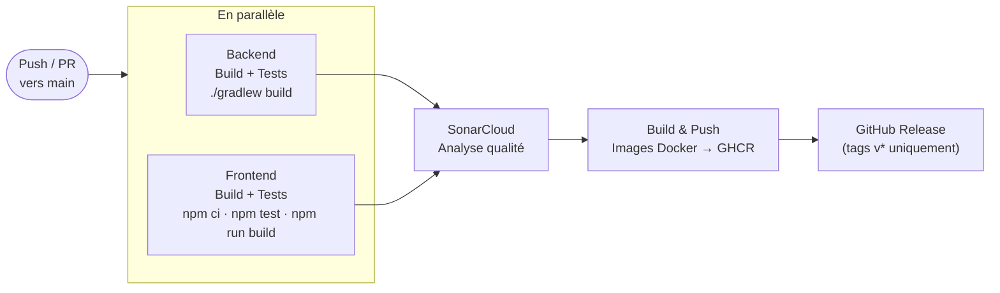

# Documentation de déploiement — MicroCRM

Ce document décrit précisément le fonctionnement du pipeline CD, chaque commande impliquée, où elle est définie, et à quel moment elle s'exécute.

---

## Démarrage rapide (opérateur)

```bash
# Déployer depuis les images GHCR (production)
docker compose pull && docker compose up -d

# Déployer avec rebuild local (développement)
docker compose up --build -d

# Déployer avec monitoring ELK
docker compose -f docker-compose.yml -f docker-compose.elk.yml up -d

# Vérifier que tout est opérationnel
curl http://localhost:8080/persons   # → 200 OK (API Spring Boot)
curl http://localhost/               # → 200 OK (SPA Angular via Caddy)

# Arrêter
docker compose down
```

**Ordre de démarrage :** le back-end démarre en premier. Le front-end attend que le healthcheck `GET /persons` soit vert (`condition: service_healthy`).

---

## Vue d'ensemble

Le déploiement est entièrement automatisé via GitHub Actions. Il se décompose en deux étapes distinctes, déclenchées par des événements Git différents :

| Étape | Déclencheur | Ce qui est produit |
|---|---|---|
| Publication des images Docker | `push` vers `main` | Images publiées sur GHCR |
| Création d'une GitHub Release | `git push origin vX.Y.Z` | JAR + archive Angular en assets téléchargeables |

Le CD ne s'exécute **jamais** sur une pull request — uniquement sur des commits atteignant `main` ou sur un tag.



---

## Prérequis au déploiement

Le CD est conditionné à la réussite du CI. Le pipeline complet doit passer dans l'ordre :

```
backend (build + tests)
frontend (build + tests + audit)
        └──► sonar (qualité)
                  └──► docker (CD — push main uniquement)
                             └──► release (CD — tag v* uniquement)
```

Si `backend` ou `frontend` échoue, `sonar` ne démarre pas. Si `sonar` échoue, `docker` ne démarre pas. Le déploiement est bloqué tant que la CI n'est pas verte.

---

## Étape 1 — Publication des images Docker (job `docker`)

### Quand

Uniquement sur un `push` vers la branche `main`. Les pull requests ne déclenchent pas cette étape.

```yaml
# .github/workflows/ci-cd.yml — ligne de condition du job docker
if: github.event_name == 'push' && github.ref == 'refs/heads/main'
```

### Registre cible

**GHCR** — GitHub Container Registry (`ghcr.io`). Intégré à GitHub, aucun compte externe requis.

```
ghcr.io/anthony-openclassroom/orion-microcrm-back
ghcr.io/anthony-openclassroom/orion-microcrm-front
```

### Détail de chaque commande

#### 1. `docker/setup-buildx-action@v4`

```yaml
- uses: docker/setup-buildx-action@v4
```

| | |
|---|---|
| **Objectif** | Active BuildKit, le moteur de build Docker avancé. Nécessaire pour utiliser le cache GitHub Actions (`type=gha`) et construire des images multi-plateformes. |
| **Définie dans** | `.github/workflows/ci-cd.yml`, job `docker` |
| **Exécutée** | CD — à chaque push vers `main` |

---

#### 2. `docker/login-action@v4`

```yaml
- uses: docker/login-action@v4
  with:
    registry: ghcr.io
    username: ${{ github.actor }}
    password: ${{ secrets.GITHUB_TOKEN }}
```

| | |
|---|---|
| **Objectif** | Authentifie le runner GitHub sur `ghcr.io` pour autoriser le push d'images. |
| **Définie dans** | `.github/workflows/ci-cd.yml`, job `docker` |
| **Exécutée** | CD — à chaque push vers `main` |
| **Secret utilisé** | `GITHUB_TOKEN` — injecté automatiquement par GitHub Actions, aucune configuration requise |

---

#### 3. `docker/metadata-action@v6`

```yaml
- id: meta-back
  uses: docker/metadata-action@v6
  with:
    images: ghcr.io/${{ github.repository_owner }}/orion-microcrm-back
    tags: |
      type=raw,value=latest
      type=sha,prefix=
```

| | |
|---|---|
| **Objectif** | Calcule les tags à appliquer à l'image. Produit la variable `steps.meta-back.outputs.tags` réutilisée par l'étape suivante. |
| **Définie dans** | `.github/workflows/ci-cd.yml`, job `docker` |
| **Exécutée** | CD — à chaque push vers `main` |

**Tags produits :**

| Tag | Exemple | Usage |
|---|---|---|
| `latest` | `orion-microcrm-back:latest` | Toujours mis à jour — pointe vers le dernier build stable |
| SHA du commit | `orion-microcrm-back:a3f8c12` | Permet de revenir à un état précis en cas de régression |

Cette action est exécutée deux fois : une fois pour l'image `back`, une fois pour l'image `front`.

---

#### 4. `docker/build-push-action@v7`

```yaml
- uses: docker/build-push-action@v7
  with:
    context: .
    target: back
    push: true
    tags: ${{ steps.meta-back.outputs.tags }}
    cache-from: type=gha
    cache-to: type=gha,mode=max
```

| | |
|---|---|
| **Objectif** | Construit l'image Docker à partir du `Dockerfile` multi-stage (stage `back` ou `front`) et la pousse sur GHCR. |
| **Définie dans** | `.github/workflows/ci-cd.yml`, job `docker` — s'appuie sur `Dockerfile` à la racine |
| **Exécutée** | CD — à chaque push vers `main` |

**Paramètres clés :**

| Paramètre | Valeur | Explication |
|---|---|---|
| `context: .` | Racine du dépôt | Nécessaire car le Dockerfile copie `./front` et `./back` |
| `target: back` | Stage nommé | Sélectionne uniquement le stage `back` du Dockerfile multi-stage |
| `push: true` | — | Publie l'image sur GHCR après le build |
| `cache-from / cache-to` | `type=gha` | Réutilise les layers Docker du run précédent. Si `package.json` n'a pas changé, `npm ci` n'est pas rejoué. Gain estimé : 1-3 min par run. |

Cette action est également exécutée deux fois : pour `back` (`target: back`) et pour `front` (`target: front`).

### Permissions requises

```yaml
permissions:
  contents: read
  packages: write
```

`packages: write` est la seule permission nécessaire pour pousser sur GHCR. `contents: read` limite l'accès au code source. Principe du moindre privilège.

### Résultat

Après ce job, les images sont disponibles publiquement :

```bash
docker pull ghcr.io/anthony-openclassroom/orion-microcrm-back:latest
docker pull ghcr.io/anthony-openclassroom/orion-microcrm-front:latest
```

---

## Étape 2 — GitHub Release (job `release`)

### Quand

Uniquement quand le ref Git est un tag commençant par `v`.

```yaml
# .github/workflows/ci-cd.yml — ligne de condition du job release
if: startsWith(github.ref, 'refs/tags/v')
```

### Comment déclencher une release

```bash
git tag v1.0.0
git push origin v1.0.0
```

La convention de versioning suivie est **SemVer** :

| Incrément | Quand |
|---|---|
| `MAJEUR` (v**2**.0.0) | Rupture de l'API ou changement incompatible |
| `MINEUR` (v1.**1**.0) | Nouvelle fonctionnalité rétrocompatible |
| `PATCH` (v1.0.**1**) | Correction de bug ou de sécurité |

### Détail de chaque commande

#### 1. `actions/download-artifact@v8` (×2)

```yaml
- uses: actions/download-artifact@v8
  with:
    name: backend-jar
    path: artifacts/

- uses: actions/download-artifact@v8
  with:
    name: frontend-dist
    path: artifacts/front/
```

| | |
|---|---|
| **Objectif** | Récupère les artefacts produits par les jobs `backend` et `frontend` du même run CI. Le JAR est déposé dans `artifacts/`, le dossier `dist/` Angular dans `artifacts/front/`. |
| **Définie dans** | `.github/workflows/ci-cd.yml`, job `release` |
| **Exécutée** | CD — création d'un tag `v*` |

---

#### 2. `zip -r microcrm-front-vX.Y.Z.zip .`

```yaml
- run: cd artifacts/front && zip -r ../microcrm-front-${{ github.ref_name }}.zip .
```

| | |
|---|---|
| **Objectif** | Archive le contenu du dossier `dist/` Angular en un fichier ZIP nommé avec le numéro de version (ex. `microcrm-front-v1.0.0.zip`). |
| **Définie dans** | `.github/workflows/ci-cd.yml`, job `release` (step `run`) |
| **Exécutée** | CD — création d'un tag `v*` |

---

#### 3. `softprops/action-gh-release@v2`

```yaml
- uses: softprops/action-gh-release@v2
  with:
    files: |
      artifacts/*.jar
      artifacts/microcrm-front-${{ github.ref_name }}.zip
  env:
    GITHUB_TOKEN: ${{ secrets.GITHUB_TOKEN }}
```

| | |
|---|---|
| **Objectif** | Crée la release sur GitHub et attache les fichiers comme assets téléchargeables depuis la page Releases du dépôt. |
| **Définie dans** | `.github/workflows/ci-cd.yml`, job `release` |
| **Exécutée** | CD — création d'un tag `v*` |
| **Secret utilisé** | `GITHUB_TOKEN` — automatique |

### Assets produits

| Fichier | Contenu | Usage |
|---|---|---|
| `microcrm-0.0.1-SNAPSHOT.jar` | JAR Spring Boot auto-suffisant | `java -jar microcrm-0.0.1-SNAPSHOT.jar` — démarre le backend sur `:8080` |
| `microcrm-front-v1.0.0.zip` | Fichiers statiques Angular compilés | Déployable sur tout hébergeur statique (Caddy, Nginx, S3, Netlify…) |

---

## Gestion des secrets

Aucune donnée sensible n'est stockée dans les images Docker ni dans les fichiers du dépôt.

| Secret | Valeur | Où est-il stocké | Comment est-il utilisé |
|---|---|---|---|
| `GITHUB_TOKEN` | Token temporaire généré par GitHub Actions à chaque run | Automatique — aucune configuration | Login GHCR, création de release |
| `SONAR_TOKEN` | Token d'accès SonarCloud | `Settings > Secrets and variables > Actions` du dépôt GitHub | Passé en variable d'environnement dans le job `sonar` uniquement |

Les valeurs de ces secrets sont automatiquement masquées dans tous les logs GitHub Actions — elles n'apparaissent jamais en clair.

---

## Récapitulatif des commandes par contexte

| Commande | Objectif | Définie dans | Exécutée lors de |
|---|---|---|---|
| `./gradlew build` | Compile le backend, lance les tests JUnit, génère le JAR et le rapport JaCoCo | `back/build.gradle` | CI — push et PR vers `main` |
| `npm ci` | Installe les dépendances frontend de manière déterministe | `front/package-lock.json` | CI — push et PR vers `main` |
| `npm test -- --no-watch --browsers=ChromeHeadlessNoSandbox` | Lance les tests Karma/Jasmine en mode headless | `front/package.json` (script `test`) + `front/karma.conf.js` | CI — push et PR vers `main` |
| `npm run build` | Compile Angular en mode production | `front/package.json` (script `build`) | CI — push et PR vers `main` |
| `npm audit --audit-level=high` | Vérifie les vulnérabilités dans les dépendances npm | `front/package.json` | CI — push et PR vers `main` |
| `./gradlew test jacocoTestReport` | Génère le rapport de couverture JaCoCo pour SonarCloud | `back/build.gradle` | CI — push et PR vers `main` (via artefact) |
| `docker/build-push-action` (target: back) | Construit et publie l'image backend sur GHCR | `.github/workflows/ci-cd.yml` | CD — push vers `main` uniquement |
| `docker/build-push-action` (target: front) | Construit et publie l'image frontend sur GHCR | `.github/workflows/ci-cd.yml` | CD — push vers `main` uniquement |
| `git tag vX.Y.Z && git push origin vX.Y.Z` | Déclenche la création d'une GitHub Release | Manuel (terminal) | Release — tag `v*` uniquement |
| `zip -r microcrm-front-vX.Y.Z.zip .` | Archive les fichiers Angular pour la release | `.github/workflows/ci-cd.yml` | CD — tag `v*` uniquement |
| `docker compose up --build` | Lance l'application complète en local via Docker | `docker-compose.yml` | Local uniquement |
