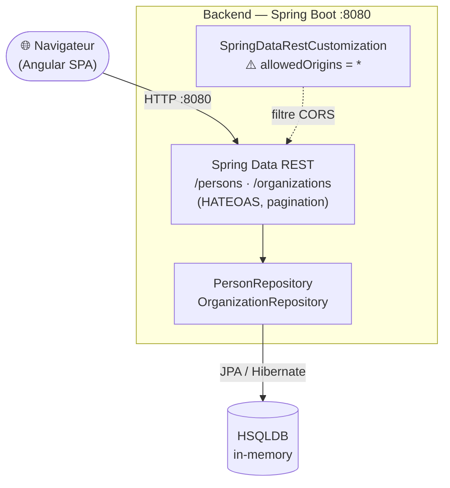
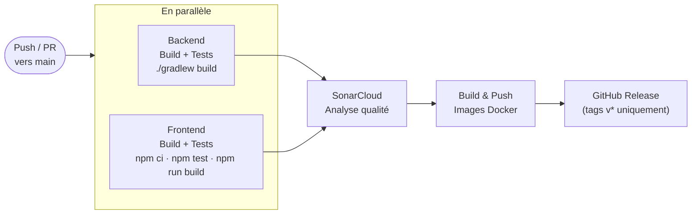

# Documentation CI/CD — MicroCRM

**Date :** 07 juin 2026 | **Auteur :** Anthony Gorski | **Option :** B — Scénario fictif Orion

---

## 1. Contexte

MicroCRM est une application de démonstration full-stack : un CRM simplifié permettant de gérer des individus et des organisations. Le dépôt est un monorepo GitHub avec un backend Spring Boot et un frontend Angular. À ce stade, l'application ne dispose d'aucun pipeline CI/CD, d'aucune analyse qualité automatisée, et son Dockerfile contient plusieurs erreurs bloquantes.

L'objectif de ce document est de formaliser les plans nécessaires à l'industrialisation, de corriger les problèmes identifiés, et de décrire le pipeline mis en place.

---

## 2. Analyse du projet

### 2.1 Stack technique

| Couche | Technologie | Version |
|---|---|---|
| Langage back | Java | 17 (LTS) |
| Framework back | Spring Boot | 3.2.5 |
| Build back | Gradle (wrapper) | 8.7 |
| Base de données | HSQLDB | In-memory, embarquée |
| Framework front | Angular | 17.3 |
| Langage front | TypeScript | 5.4 |
| Tests back | JUnit 5 + Spring Boot Test | — |
| Tests front | Karma + Jasmine | — |

### 2.2 Architecture



**API exposée :** Spring Data REST génère automatiquement les endpoints REST avec HATEOAS. Aucune couche Controller custom — tout passe par les repositories.

**Données :** HSQLDB in-memory. Aucune persistance entre redémarrages. Un `InitialDataFixture` alimente la base au démarrage.

### 2.3 Commandes locales

```bash
# Backend
cd back && ./gradlew build                              # compile + tests + JAR
java -jar build/libs/microcrm-0.0.1-SNAPSHOT.jar       # démarre sur :8080

# Frontend
cd front && npm install && npm start                    # dev sur :4200
npm run build                                           # build prod → dist/microcrm/browser/

# Tests
cd back && ./gradlew test
cd front && npm test -- --no-watch --browsers=ChromeHeadlessNoSandbox
```

### 2.4 Problèmes identifiés

**Erreurs dans le Dockerfile :**

| Fichier | Ligne | Problème | Correction |
|---|---|---|---|
| `Dockerfile` | 1 | `FROM node` — image non épinglée, build non reproductible | `FROM node:20-alpine` |
| `Dockerfile` | 10 | `FROM gradle:jdk17` — version non épinglée | `FROM gradle:8.7-jdk17` |
| `Dockerfile` | 40 | `EXPOSE 4200` sur le stage `back` — Spring Boot écoute sur 8080 | `EXPOSE 8080` |
| `Dockerfile` | 35 | `openjdk21-jre-headless` alors que le build cible Java 17 | `eclipse-temurin:17-jre-alpine` |

**Autres points bloquants :**

- `front/src/app/config.ts:1` — `API_BASE_URL` hardcodée à `http://localhost:8080`. Dans un déploiement Docker où le front est servi par Caddy, le navigateur client cherche le backend sur `localhost:8080` — ça fonctionne si les deux ports sont exposés, mais ce n'est pas paramétrable.
- `back/src/main/java/.../SpringDataRestCustomization.java:14` — CORS ouvert (`allowedOrigins("*")`). Acceptable en développement, risque en production.
- Aucun workflow GitHub Actions — pas de CI/CD configuré.
- Pas de `docker-compose.yml`.

### 2.5 Veille technologique

| Outil | Version projet | Recommandée | Note |
|---|---|---|---|
| Spring Boot | 3.2.5 | 3.4.x | 3.2.x en fin de support |
| Java | 17 LTS | 21 LTS | Fonctionnel, Java 21 préféré |
| Gradle | 8.7 | 8.10+ | Mettre à jour |
| Angular | 17.3 | 18+ | 17 en maintenance |
| Node.js | non épinglé | 20 LTS | À épingler |

Pour ce projet, les versions actuelles restent fonctionnelles. Les mises à jour sont à planifier en backlog.

---

## 3. Pipeline CI/CD

### 3.1 Flux



Les jobs Backend et Frontend tournent en parallèle. SonarCloud attend les deux. Le CD (Docker + Release) ne s'exécute que sur `push` vers `main` — les pull requests s'arrêtent après Sonar.

### 3.2 Workflow — `.github/workflows/ci-cd.yml`

```yaml
name: CI/CD

on:
  push:
    branches: [main]
  pull_request:
    branches: [main]

jobs:

  backend:
    runs-on: ubuntu-latest
    defaults:
      run:
        working-directory: back
    steps:
      - uses: actions/checkout@v4
      - uses: actions/setup-java@v4
        with:
          java-version: "17"
          distribution: temurin
          cache: gradle
      - run: chmod +x gradlew && ./gradlew build
      - uses: actions/upload-artifact@v4
        with:
          name: backend-jar
          path: back/build/libs/*.jar

  frontend:
    runs-on: ubuntu-latest
    defaults:
      run:
        working-directory: front
    steps:
      - uses: actions/checkout@v4
      - uses: actions/setup-node@v4
        with:
          node-version: "20"
          cache: npm
          cache-dependency-path: front/package-lock.json
      - run: npm ci
      - run: npm test -- --no-watch --browsers=ChromeHeadlessNoSandbox
      - run: npm run build
      - run: npm audit --audit-level=high
        continue-on-error: true
      - uses: actions/upload-artifact@v4
        with:
          name: frontend-dist
          path: front/dist/microcrm/browser/

  sonar:
    runs-on: ubuntu-latest
    needs: [backend, frontend]
    continue-on-error: true  # ne bloque pas la CI si Sonar est indisponible
    steps:
      - uses: actions/checkout@v4
        with:
          fetch-depth: 0
      - uses: actions/setup-java@v4
        with:
          java-version: "17"
          distribution: temurin
          cache: gradle
      - run: cd back && chmod +x gradlew && ./gradlew test jacocoTestReport
      - uses: SonarSource/sonarqube-scan-action@v6
        env:
          GITHUB_TOKEN: ${{ secrets.GITHUB_TOKEN }}
          SONAR_TOKEN: ${{ secrets.SONAR_TOKEN }}
        with:
          args: >
            -Dsonar.projectKey=${{ vars.SONAR_PROJECT_KEY }}
            -Dsonar.organization=${{ vars.SONAR_ORGANIZATION }}
            -Dsonar.sources=back/src/main,front/src
            -Dsonar.java.binaries=back/build/classes
            -Dsonar.coverage.jacoco.xmlReportPaths=back/build/reports/jacoco/test/jacocoTestReport.xml
            -Dsonar.exclusions=**/node_modules/**,**/dist/**,**/*.spec.ts

  docker:
    runs-on: ubuntu-latest
    needs: [sonar]
    if: github.event_name == 'push' && github.ref == 'refs/heads/main'
    steps:
      - uses: actions/checkout@v4
      - uses: docker/setup-buildx-action@v3
      - uses: docker/login-action@v3
        with:
          username: ${{ secrets.DOCKERHUB_USERNAME }}
          password: ${{ secrets.DOCKERHUB_TOKEN }}
      - id: meta-back
        uses: docker/metadata-action@v5
        with:
          images: ${{ secrets.DOCKERHUB_USERNAME }}/orion-microcrm-back
          tags: |
            type=raw,value=latest
            type=sha,prefix=
      - uses: docker/build-push-action@v6
        with:
          context: .
          target: back
          push: true
          tags: ${{ steps.meta-back.outputs.tags }}
          cache-from: type=gha
          cache-to: type=gha,mode=max
      - id: meta-front
        uses: docker/metadata-action@v5
        with:
          images: ${{ secrets.DOCKERHUB_USERNAME }}/orion-microcrm-front
          tags: |
            type=raw,value=latest
            type=sha,prefix=
      - uses: docker/build-push-action@v6
        with:
          context: .
          target: front
          push: true
          tags: ${{ steps.meta-front.outputs.tags }}
          cache-from: type=gha
          cache-to: type=gha,mode=max

  release:
    runs-on: ubuntu-latest
    needs: [docker]
    if: startsWith(github.ref, 'refs/tags/v')
    steps:
      - uses: actions/checkout@v4
      - uses: actions/download-artifact@v4
        with:
          name: backend-jar
          path: artifacts/
      - uses: actions/download-artifact@v4
        with:
          name: frontend-dist
          path: artifacts/front/
      - run: cd artifacts/front && zip -r ../microcrm-front-${{ github.ref_name }}.zip .
      - uses: softprops/action-gh-release@v2
        with:
          files: |
            artifacts/*.jar
            artifacts/microcrm-front-${{ github.ref_name }}.zip
        env:
          GITHUB_TOKEN: ${{ secrets.GITHUB_TOKEN }}
```

### 3.3 Secrets et variables GitHub

| Type | Nom | Usage |
|---|---|---|
| Secret | `DOCKERHUB_TOKEN` | Push des images |
| Secret | `SONAR_TOKEN` | Analyse SonarCloud |
| Secret | `DOCKERHUB_USERNAME` | Compte Docker Hub |
| Variable | `SONAR_PROJECT_KEY`, `SONAR_ORGANIZATION` | Projet SonarCloud |

### 3.4 Activer JaCoCo

Ajouter dans `back/build.gradle` :

```groovy
plugins {
    // ... plugins existants ...
    id 'jacoco'
}
jacocoTestReport {
    dependsOn test
    reports { xml.required = true }
}
```

Et créer `sonar-project.properties` à la racine :

```properties
sonar.projectKey=microcrm
sonar.sources=back/src/main,front/src
sonar.tests=back/src/test
sonar.java.binaries=back/build/classes
sonar.exclusions=**/node_modules/**,**/dist/**,**/*.spec.ts
```

---

## 4. Conteneurisation

### 4.1 Dockerfile corrigé

```dockerfile
FROM node:20-alpine AS front-build
WORKDIR /src
COPY ./front/package*.json ./
RUN npm ci
COPY ./front .
RUN npx @angular/cli build --configuration=production

FROM gradle:8.7-jdk17 AS back-build
WORKDIR /src
COPY ./back .
RUN ./gradlew build -x test

FROM caddy:2-alpine AS front
COPY --from=front-build /src/dist/microcrm/browser /srv
COPY misc/docker/Caddyfile /etc/caddy/Caddyfile
EXPOSE 80 443

FROM eclipse-temurin:17-jre-alpine AS back
WORKDIR /app
COPY --from=back-build /src/build/libs/microcrm-0.0.1-SNAPSHOT.jar app.jar
EXPOSE 8080
ENTRYPOINT ["java", "-jar", "app.jar"]

FROM alpine:3.19 AS standalone
RUN apk add --no-cache supervisor caddy openjdk17-jre-headless
COPY --from=front-build /src/dist/microcrm/browser /app/front
COPY --from=back-build /src/build/libs/microcrm-0.0.1-SNAPSHOT.jar /app/back/app.jar
COPY misc/docker/Caddyfile /app/Caddyfile
COPY misc/docker/supervisor.ini /etc/supervisor.d/app.ini
EXPOSE 80 443 8080
CMD ["/usr/bin/supervisord", "-n"]
```

### 4.2 docker-compose.yml

```yaml
services:
  back:
    build:
      context: .
      target: back
    ports:
      - "8080:8080"
    healthcheck:
      test: ["CMD", "wget", "-qO-", "http://localhost:8080/persons"]
      interval: 10s
      retries: 5

  front:
    build:
      context: .
      target: front
    ports:
      - "80:80"
      - "443:443"
    depends_on:
      back:
        condition: service_healthy
```

```bash
docker-compose up --build
```

---

## 5. Plan de testing

### 5.1 Tests existants

**Backend :**

| Classe | Annotation | Ce qui est testé |
|---|---|---|
| `MicroCRMApplicationTests` | `@SpringBootTest` | Le contexte Spring démarre sans erreur |
| `PersonRepositoryIntegrationTest` | `@DataJpaTest` | `findByEmail` via HSQLDB in-memory |

**Frontend :**

| Fichier spec | Ce qui est testé |
|---|---|
| `app.component.spec.ts` | Création, titre, rendu H1 |
| `main-dashboard.component.spec.ts` | Création du composant |
| `person-details.component.spec.ts` | Création du composant |
| `organization-details.component.spec.ts` | Création du composant |
| `person.service.spec.ts` | Instanciation du service |
| `organization.service.spec.ts` | Instanciation du service |

Tous les tests front utilisent `HttpClientTestingModule` (mock HTTP) et `RouterTestingModule`.

### 5.2 Fréquence et objectifs

| Événement | Tests exécutés | Objectif |
|---|---|---|
| Push vers `main` | Back + front + Sonar + CD | Validation avant déploiement |
| Pull request vers `main` | Back + front + Sonar | Non-régression avant merge |

**Limite :** les tests actuels sont des smoke tests (instanciation et démarrage de contexte). Ils détectent les erreurs de compilation et de câblage, pas les régressions fonctionnelles. Des tests REST via `MockMvc` et des tests de comportement Angular sont à ajouter pour atteindre une couverture métier significative.

---

## 6. Plan de sécurité

### 6.1 Analyse des risques

La criticité est calculée selon : **C = Fréquence (F) × Gravité (G)**

| Risque | F | G | C | Niveau |
|---|:---:|:---:|:---:|---|
| CORS ouvert `allowedOrigins("*")` en prod | 3 | 3 | **9** | 🟠 Élevé |
| Image `node` non épinglée — build non reproductible | 4 | 2 | **8** | 🟡 Modéré |
| Mismatch JDK (build 17, runtime 21) | 3 | 2 | **6** | 🟡 Modéré |
| Port 4200 exposé au lieu de 8080 sur le stage `back` | 4 | 2 | **8** | 🟡 Modéré |
| `API_BASE_URL` hardcodée — non paramétrable | 3 | 2 | **6** | 🟡 Modéré |
| Aucun test fonctionnel — régressions non détectées | 2 | 3 | **6** | 🟡 Modéré |
| Absence de Quality Gate SonarCloud | 2 | 2 | **4** | 🟢 Faible |

🟢 1–4 Faible | 🟡 5–8 Modéré | 🟠 9–12 Élevé | 🔴 13–16 Critique

### 6.2 SonarQube Cloud

Analyse à chaque CI : bugs, vulnérabilités, security hotspots, code smells, couverture.

Le job `sonar` est en `continue-on-error: true` pour ne pas bloquer la CI pendant la phase de configuration initiale. Une fois le Quality Gate défini, retirer cette option pour le rendre bloquant.

### 6.3 Gestion des secrets

Aucun secret en clair dans le code. Référence des clés à maintenir (sans valeurs) :
- `DOCKERHUB_TOKEN`, `SONAR_TOKEN` → GitHub Secrets
- Aucune credential dans les images Docker ni dans les fichiers committés

### 6.4 Plan d'action

| Horizon | Actions |
|---|---|
| **Immédiat** | Corriger les 4 erreurs Dockerfile ; activer SonarCloud ; créer le workflow CI/CD |
| **Court terme** | Restreindre CORS en production ; externaliser `API_BASE_URL` (Angular environments) |
| **Long terme** | Durcir le Quality Gate ; ajouter des tests fonctionnels ; auditer les dépendances (`npm audit`, OWASP Dependency-Check) |

---

## 7. Versioning et releases

**Politique SemVer :** `vMAJEUR.MINEUR.PATCH`

| Incrément | Quand |
|---|---|
| `MAJEUR` | Rupture de l'API ou du comportement |
| `MINEUR` | Nouvelle fonctionnalité rétrocompatible |
| `PATCH` | Correction de bug |

La release est déclenchée **manuellement** par création d'un tag :

```bash
git tag v1.0.0 && git push origin v1.0.0
```

Le workflow `release` (dans `ci-cd.yml`) se déclenche alors automatiquement et publie le JAR et l'archive Angular sur GitHub Releases, ainsi que les images Docker taguées `v1.0.0` sur Docker Hub.

Pas de release automatique à chaque commit. Pas de branches par release — le modèle `main` + tags est suffisant pour ce projet.

---

## 8. Monitoring et métriques DORA

| Métrique DORA | Source | Comment la mesurer |
|---|---|---|
| **Lead Time** | Onglet Actions | Durée totale du workflow CI/CD sur `main` |
| **Deployment Frequency** | Onglet Actions | Nombre de runs CD réussis par semaine |
| **MTTR** | Onglet Actions | Durée entre un run échoué et le run vert suivant |
| **Change Failure Rate** | Onglet Actions | (Runs CD échoués / total) × 100 |

Les valeurs seront renseignées après les premières semaines d'utilisation. L'onglet Actions de GitHub fournit l'historique et les durées nécessaires au calcul.

---

## 9. Sauvegarde et mises à jour

**Sauvegarde :**

- Code → Git (GitHub)
- Artefacts → GitHub Releases (JAR + archive front) à chaque tag `v*`
- Images → Docker Hub (`latest` + `vX.Y.Z` + SHA)
- HSQLDB in-memory — pas de données persistantes à sauvegarder

**Mises à jour à planifier :**

- Spring Boot 3.2.x → 3.4.x (fin de support)
- Angular 17 → 18+ (version en maintenance)
- Gradle 8.7 → 8.10+
- Tags des images de base Docker après chaque patch de sécurité
- Actions GitHub (`@v4`, `@v6`) — suivre les release notes

---

## Livrables

| Livrable | Emplacement |
|---|---|
| Workflow CI/CD | `.github/workflows/ci-cd.yml` |
| Dockerfile corrigé | `Dockerfile` |
| Docker Compose | `docker-compose.yml` |
| Configuration Sonar | `sonar-project.properties` |
| Documentation | `rapport.md` |
