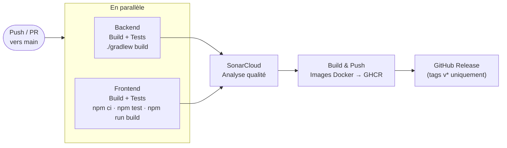

# Documentation CI/CD — MicroCRM

**Date :** 07 juin 2026 | **Auteur :** Anthony Gorski | **Option :** B — Scénario fictif Orion

---

## 1. Contexte

MicroCRM est une application de démonstration full-stack : un CRM simplifié permettant de gérer des individus et des organisations. Le dépôt est un monorepo GitHub avec un backend Spring Boot et un frontend Angular.

Ce document décrit les plans d'industrialisation, les corrections apportées au projet initial (Dockerfile, pipeline, qualité), et l'état actuel de la configuration CI/CD.

---

## 2. Analyse du projet

### 2.1 Stack technique

| Couche | Technologie | Version |
|---|---|---|
| Langage back | Java | 17 (LTS) |
| Framework back | Spring Boot | 3.2.5 |
| Build back | Gradle (wrapper) | 8.7 |
| Base de données | HSQLDB | In-memory, embarquée |
| Framework front | Angular | 17.3 |
| Langage front | TypeScript | 5.4 |
| Tests back | JUnit 5 + Spring Boot Test | — |
| Tests front | Karma + Jasmine | — |

### 2.2 Architecture


**API exposée :** Spring Data REST génère automatiquement les endpoints REST avec HATEOAS. Aucune couche Controller custom — tout passe par les repositories.

**Données :** HSQLDB in-memory. Aucune persistance entre redémarrages. Un `InitialDataFixture` alimente la base au démarrage.

### 2.3 Commandes locales

```bash
# Backend
cd back && ./gradlew build                              # compile + tests + JAR
java -jar build/libs/microcrm-0.0.1-SNAPSHOT.jar       # démarre sur :8080

# Frontend
cd front && npm install && npm start                    # dev sur :4200
npm run build                                           # build prod → dist/microcrm/browser/

# Tests
cd back && ./gradlew test
cd front && npm test -- --no-watch --browsers=ChromeHeadlessNoSandbox
```

### 2.4 Problèmes identifiés et corrigés

**Dockerfile — corrections apportées :**

| Ligne | Problème initial | Correction |
|---|---|---|
| 1 | `FROM node` — image non épinglée | `FROM node:20-alpine` |
| 10 | `FROM gradle:jdk17` — version non épinglée | `FROM gradle:8.7-jdk17` |
| 36 | `openjdk21-jre-headless` — mismatch avec le build Java 17 | `eclipse-temurin:17-jre-alpine` |
| 40 | `EXPOSE 4200` sur le stage `back` — Spring Boot écoute sur 8080 | `EXPOSE 8080` |
| — | Processus exécutés en `root` | User non-root `appuser` + `setcap` sur Caddy |
| — | `COPY --from=front / /` fragile dans `standalone` | Install explicite des dépendances |

**Autres points :**

- `front/src/app/config.ts:1` — `API_BASE_URL` hardcodée à `http://localhost:8080`. Fonctionne si les deux ports sont exposés, mais non paramétrable. À externaliser via Angular environments.
- `back/.../SpringDataRestCustomization.java:14` — CORS ouvert (`allowedOrigins("*")`). À restreindre en production.

### 2.5 Veille technologique

| Outil | Version projet | Recommandée | Note |
|---|---|---|---|
| Spring Boot | 3.2.5 | 3.4.x | 3.2.x en fin de support |
| Java | 17 LTS | 21 LTS | Fonctionnel, Java 21 préféré |
| Gradle | 8.7 | 8.10+ | Mettre à jour |
| Angular | 17.3 | 18+ | 17 en maintenance |
| Node.js | 20 LTS | 20 LTS | Épinglé ✓ |

---

## 3. Pipeline CI/CD

### 3.1 Flux



Les jobs Backend et Frontend tournent en parallèle. SonarCloud attend les deux. Le CD (Docker + Release) ne s'exécute que sur `push` vers `main` — les pull requests s'arrêtent après Sonar.

### 3.2 Workflow — `.github/workflows/ci-cd.yml`

```yaml
name: CI/CD

on:
  push:
    branches: [main]
  pull_request:
    branches: [main]

jobs:

  backend:
    runs-on: ubuntu-latest
    defaults:
      run:
        working-directory: back
    steps:
      - uses: actions/checkout@v4
      - uses: actions/setup-java@v4
        with:
          java-version: "17"
          distribution: temurin
          cache: gradle
      - run: chmod +x gradlew && ./gradlew build
      - uses: actions/upload-artifact@v4
        with:
          name: backend-jar
          path: back/build/libs/*.jar

  frontend:
    runs-on: ubuntu-latest
    defaults:
      run:
        working-directory: front
    steps:
      - uses: actions/checkout@v4
      - uses: actions/setup-node@v4
        with:
          node-version: "20"
          cache: npm
          cache-dependency-path: front/package-lock.json
      - run: npm ci
      - run: npm test -- --no-watch --browsers=ChromeHeadlessNoSandbox
      - run: npm run build
      - run: npm audit --audit-level=high
        continue-on-error: true
      - uses: actions/upload-artifact@v4
        with:
          name: frontend-dist
          path: front/dist/microcrm/browser/

  sonar:
    runs-on: ubuntu-latest
    needs: [backend, frontend]
    continue-on-error: true
    steps:
      - uses: actions/checkout@v4
        with:
          fetch-depth: 0
      - uses: actions/setup-java@v4
        with:
          java-version: "17"
          distribution: temurin
          cache: gradle
      - run: cd back && chmod +x gradlew && ./gradlew test jacocoTestReport
      - uses: SonarSource/sonarqube-scan-action@v6
        env:
          GITHUB_TOKEN: ${{ secrets.GITHUB_TOKEN }}
          SONAR_TOKEN: ${{ secrets.SONAR_TOKEN }}
        with:
          args: >
            -Dsonar.sources=back/src/main,front/src
            -Dsonar.java.binaries=back/build/classes
            -Dsonar.coverage.jacoco.xmlReportPaths=back/build/reports/jacoco/test/jacocoTestReport.xml
            -Dsonar.exclusions=**/node_modules/**,**/dist/**,**/*.spec.ts

  docker:
    runs-on: ubuntu-latest
    needs: [sonar]
    if: github.event_name == 'push' && github.ref == 'refs/heads/main'
    permissions:
      contents: read
      packages: write
    steps:
      - uses: actions/checkout@v4
      - uses: docker/setup-buildx-action@v3
      - uses: docker/login-action@v3
        with:
          registry: ghcr.io
          username: ${{ github.actor }}
          password: ${{ secrets.GITHUB_TOKEN }}
      - id: meta-back
        uses: docker/metadata-action@v5
        with:
          images: ghcr.io/${{ github.repository_owner }}/orion-microcrm-back
          tags: |
            type=raw,value=latest
            type=sha,prefix=
      - uses: docker/build-push-action@v6
        with:
          context: .
          target: back
          push: true
          tags: ${{ steps.meta-back.outputs.tags }}
          cache-from: type=gha
          cache-to: type=gha,mode=max
      - id: meta-front
        uses: docker/metadata-action@v5
        with:
          images: ghcr.io/${{ github.repository_owner }}/orion-microcrm-front
          tags: |
            type=raw,value=latest
            type=sha,prefix=
      - uses: docker/build-push-action@v6
        with:
          context: .
          target: front
          push: true
          tags: ${{ steps.meta-front.outputs.tags }}
          cache-from: type=gha
          cache-to: type=gha,mode=max

  release:
    runs-on: ubuntu-latest
    needs: [docker]
    if: startsWith(github.ref, 'refs/tags/v')
    steps:
      - uses: actions/checkout@v4
      - uses: actions/download-artifact@v4
        with:
          name: backend-jar
          path: artifacts/
      - uses: actions/download-artifact@v4
        with:
          name: frontend-dist
          path: artifacts/front/
      - run: cd artifacts/front && zip -r ../microcrm-front-${{ github.ref_name }}.zip .
      - uses: softprops/action-gh-release@v2
        with:
          files: |
            artifacts/*.jar
            artifacts/microcrm-front-${{ github.ref_name }}.zip
        env:
          GITHUB_TOKEN: ${{ secrets.GITHUB_TOKEN }}
```

### 3.3 Secrets requis

| Secret | Usage | Configuration |
|---|---|---|
| `GITHUB_TOKEN` | Login GHCR + release GitHub | Automatique — fourni par GitHub Actions |
| `SONAR_TOKEN` | Analyse SonarCloud | `Settings > Secrets > Actions` |

La configuration Sonar (clé projet, organisation) est dans `sonar-project.properties` — aucune variable GitHub requise.

### 3.4 Configuration Sonar et JaCoCo

`sonar-project.properties` à la racine :

```properties
sonar.projectKey=microcrm
sonar.organization=anthony-openclassroom
sonar.sources=back/src/main,front/src
sonar.tests=back/src/test
sonar.java.binaries=back/build/classes
sonar.exclusions=**/node_modules/**,**/dist/**,**/*.spec.ts
```

JaCoCo dans `back/build.gradle` :

```groovy
plugins {
    // ... plugins existants ...
    id 'jacoco'
}
jacocoTestReport {
    dependsOn test
    reports { xml.required = true }
}
```

---

## 4. Conteneurisation

### 4.1 Dockerfile

Build multi-étapes avec trois cibles. Points clés :

- Images épinglées sur des versions précises (`node:20-alpine`, `gradle:8.7-jdk17`, `eclipse-temurin:17-jre-alpine`)
- Stages `back` et `standalone` : exécution en user non-root (`appuser`) — `setcap cap_net_bind_service` sur Caddy pour binder 80/443 sans root
- Stage `standalone` : install explicite des dépendances plutôt que `COPY --from=image / /`

```dockerfile
FROM node:20-alpine AS front-build
WORKDIR /src
COPY ./front/package*.json ./
RUN npm ci
COPY ./front .
RUN npx @angular/cli build --configuration=production

FROM gradle:8.7-jdk17 AS back-build
WORKDIR /src
COPY ./back .
RUN ./gradlew build -x test

FROM caddy:2-alpine AS front
COPY --from=front-build /src/dist/microcrm/browser /app/front
COPY misc/docker/Caddyfile /etc/caddy/Caddyfile
EXPOSE 80 443

FROM eclipse-temurin:17-jre-alpine AS back
WORKDIR /app
COPY --from=back-build /src/build/libs/microcrm-0.0.1-SNAPSHOT.jar app.jar
RUN addgroup -S appgroup && adduser -S appuser -G appgroup \
    && chown -R appuser:appgroup /app
USER appuser
EXPOSE 8080
ENTRYPOINT ["java", "-jar", "app.jar"]

FROM alpine:3.19 AS standalone
WORKDIR /app
RUN apk add --no-cache supervisor caddy openjdk17-jre-headless libcap
COPY --from=front-build /src/dist/microcrm/browser /app/front
COPY --from=back-build /src/build/libs/microcrm-0.0.1-SNAPSHOT.jar /app/back/microcrm-0.0.1-SNAPSHOT.jar
COPY misc/docker/Caddyfile /app/Caddyfile
COPY misc/docker/supervisor.ini /app/supervisor.ini
RUN setcap 'cap_net_bind_service=+ep' /usr/sbin/caddy
RUN addgroup -S appgroup && adduser -S appuser -G appgroup \
    && chown -R appuser:appgroup /app
USER appuser
EXPOSE 80 443 8080
CMD ["/usr/bin/supervisord", "-c", "/app/supervisor.ini"]
```

### 4.2 docker-compose.yml

```yaml
services:
  back:
    build:
      context: .
      target: back
    ports:
      - "8080:8080"
    healthcheck:
      test: ["CMD", "wget", "-qO-", "http://localhost:8080/persons"]
      interval: 10s
      retries: 5

  front:
    build:
      context: .
      target: front
    ports:
      - "80:80"
      - "443:443"
    depends_on:
      back:
        condition: service_healthy
```

```bash
docker-compose up --build
```

---

## 5. Plan de testing

### 5.1 Tests existants

**Backend :**

| Classe | Annotation | Ce qui est testé |
|---|---|---|
| `MicroCRMApplicationTests` | `@SpringBootTest` | Le contexte Spring démarre sans erreur |
| `PersonRepositoryIntegrationTest` | `@DataJpaTest` | `findByEmail` via HSQLDB in-memory |

**Frontend :**

| Fichier spec | Ce qui est testé |
|---|---|
| `app.component.spec.ts` | Création, titre, rendu H1 |
| `main-dashboard.component.spec.ts` | Création du composant |
| `person-details.component.spec.ts` | Création du composant |
| `organization-details.component.spec.ts` | Création du composant |
| `person.service.spec.ts` | Instanciation du service |
| `organization.service.spec.ts` | Instanciation du service |

Tous les tests front utilisent `HttpClientTestingModule` (mock HTTP) et `RouterTestingModule`.

### 5.2 Fréquence et objectifs

| Événement | Tests exécutés | Objectif |
|---|---|---|
| Push vers `main` | Back + front + Sonar + CD | Validation avant déploiement |
| Pull request vers `main` | Back + front + Sonar | Non-régression avant merge |

**Limite :** les tests actuels sont des smoke tests (instanciation et démarrage de contexte). Des tests REST via `MockMvc` et des tests de comportement Angular sont à ajouter pour atteindre une couverture métier significative.

---

## 6. Plan de sécurité

### 6.1 Analyse des risques

La criticité est calculée selon : **C = Fréquence (F) × Gravité (G)**

| Risque | F | G | C | Niveau | Statut |
|---|:---:|:---:|:---:|---|---|
| CORS ouvert `allowedOrigins("*")` en prod | 3 | 3 | **9** | 🟠 Élevé | En cours |
| `API_BASE_URL` hardcodée — non paramétrable | 3 | 2 | **6** | 🟡 Modéré | En cours |
| Aucun test fonctionnel — régressions non détectées | 2 | 3 | **6** | 🟡 Modéré | En cours |
| Absence de Quality Gate SonarCloud | 2 | 2 | **4** | 🟢 Faible | En cours |
| Image `node` non épinglée | 4 | 2 | **8** | 🟡 Modéré | ✅ Corrigé |
| Mismatch JDK (build 17, runtime 21) | 3 | 2 | **6** | 🟡 Modéré | ✅ Corrigé |
| Port 4200 exposé au lieu de 8080 | 4 | 2 | **8** | 🟡 Modéré | ✅ Corrigé |
| Conteneurs exécutés en root | 3 | 3 | **9** | 🟠 Élevé | ✅ Corrigé |

🟢 1–4 Faible | 🟡 5–8 Modéré | 🟠 9–12 Élevé | 🔴 13–16 Critique

### 6.2 SonarQube Cloud

Analyse à chaque CI : bugs, vulnérabilités, security hotspots, code smells, couverture.

Le job `sonar` est en `continue-on-error: true` pendant la phase de configuration initiale. Une fois le Quality Gate défini, retirer cette option pour le rendre bloquant.

### 6.3 Gestion des secrets

| Secret | Stockage |
|---|---|
| `SONAR_TOKEN` | GitHub Secrets |
| `GITHUB_TOKEN` | Automatique — aucune configuration requise |

Aucune credential dans les images Docker ni dans les fichiers committés. La configuration Sonar (clé, organisation) est dans `sonar-project.properties`, pas dans des variables GitHub.

### 6.4 Plan d'action

| Horizon | Actions | Statut |
|---|---|---|
| **Immédiat** | Corriger Dockerfile, activer SonarCloud, créer CI/CD | ✅ Fait |
| **Court terme** | Restreindre CORS en production ; externaliser `API_BASE_URL` | En cours |
| **Long terme** | Durcir le Quality Gate ; ajouter tests fonctionnels ; `npm audit` + OWASP Dependency-Check | À planifier |

---

## 7. Versioning et releases

**Politique SemVer :** `vMAJEUR.MINEUR.PATCH`

| Incrément | Quand |
|---|---|
| `MAJEUR` | Rupture de l'API ou du comportement |
| `MINEUR` | Nouvelle fonctionnalité rétrocompatible |
| `PATCH` | Correction de bug ou de sécurité |

La release est déclenchée **manuellement** par création d'un tag :

```bash
git tag v1.0.0 && git push origin v1.0.0
```

Le workflow `release` publie le JAR et l'archive Angular sur GitHub Releases. Les images Docker sont taguées et publiées sur **GHCR** (`ghcr.io/anthony-openclassroom/orion-microcrm-back|front`).

Pas de release automatique à chaque commit. Modèle `main` + tags — pas de branches par release.

---

## 8. Monitoring et métriques DORA

| Métrique DORA | Source | Comment la mesurer |
|---|---|---|
| **Lead Time** | Onglet Actions | Durée totale du workflow CI/CD sur `main` |
| **Deployment Frequency** | Onglet Actions | Nombre de runs CD réussis par semaine |
| **MTTR** | Onglet Actions | Durée entre un run échoué et le run vert suivant |
| **Change Failure Rate** | Onglet Actions | (Runs CD échoués / total) × 100 |

Les valeurs seront renseignées après les premières semaines d'utilisation.

---

## 9. Sauvegarde et mises à jour

**Sauvegarde :**

- Code → Git (GitHub)
- Artefacts → GitHub Releases (JAR + archive front) à chaque tag `v*`
- Images → GHCR (`latest` + SHA + `vX.Y.Z`)
- HSQLDB in-memory — pas de données persistantes à sauvegarder

**Mises à jour à planifier :**

- Spring Boot 3.2.x → 3.4.x (fin de support)
- Angular 17 → 18+ (version en maintenance)
- Gradle 8.7 → 8.10+
- Tags des images de base Docker après chaque patch de sécurité
- Actions GitHub (`@v4`, `@v6`) — suivre les release notes

---

## Livrables

| Livrable | Emplacement |
|---|---|
| Workflow CI/CD | `.github/workflows/ci-cd.yml` |
| Dockerfile | `Dockerfile` |
| Docker Compose | `docker-compose.yml` |
| Configuration Sonar | `sonar-project.properties` |
| Documentation | `rapport.md` |
